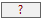

# Colormap User's Guide

Inspired from **Steven Mileham** [script](https://gist.github.com/smileham/4bbca832d8fe629b72beb4e2b9a4b7ea) and [blog](https://smileham.co.uk/2022/06/15/archi-jarchi-and-rag-status-maps/), a completely redesigned Heatmap/Colormap function as a SWT Wizard to set a visual element background color based on it's property value.

## Installation

Following files and directory structure **MUST** be copied in the jArchi scripting directory (`__SCRIPTS_DIR__`) or a subdirectory and shall respect the tree structure.

```
Colormap/
    Wizard.ajs - launch the Wizard on the current view
    Reapply on selected view.ajs - reapply the color scheme of the selected view
    Reapply on model.ajs - reapply to all views of the model
lib/
    misc.js - scripts common utilities
    colormap/
        Model.js 
        Wizard.js
        ImageRegistry.js
        scheme/ - directory to store/retrieve default property color schemes
```

## Execution

The **Wizard** is organized in 3 steps. As with any wizard, it is possible to go back and forth between pages with `< Back` and `Next >` buttons. `Cancel` will stop the Wizard. `Finish` will execute the colorization, if all necessary choices are made.

The **Reapply** scripts will apply directly the colormap saved default color scheme to the view (resp. model views). See scripts [documentation](Colormap%20reapply.md).

### 1) Property selection step

All properties found in any visual element of the current view are listed for selection. Default is last applied property color scheme if any.


Selecting `Next >` will lead to ...

### 2) Labels selection step

The page shows all possible labels associated with the selected property, and used in the selected view. It is possible to select only subset of the values using the checkbox. The `(all labels)` checkbox is a short cut to check or uncheck all labels in the list.


As long as at least one label is selected, it is possible to progress to next page.

if all selected labels are numeric or starts with a number, it is possible to use a **continuous** (= gradient) color scheme instead of the standard categorical (= discrete) color scheme.


### 3.a) Categorical color scheme 

in this page, you can set a specific color per property label, by either double clicking the color, or using the `Set color` button (multiple selection is possible in this case). NB: The custom color palette is the one used by archimate.

A property label which color has not been defined yet is represented by .


The `Reset other to default color` checkbox will instruct to reset to Archi default color all visual elements which don't have the property or a property label color defined.

The `Color scheme` section is explained below. If a saved color scheme exists for the property, it will be applied by default.


### 3.b) Continuous color scheme 

In this scheme, you define the colors for the lowest and highest numerical values of the property labels. A proportional gradient color scheme is applied to each label numerical value.


It's possible to set a middle color in the gradient. The position of the color can be defined by clicking directly on the gradient or editing the value in the spinner box.


A color which has not been defined yet is represented by .

### Creating or reloading color scheme

In step 3), for both color schemes, you can save the current color definition as the default definition for the selected property (and the one to reapply, see [reapply scripts](Colormap%20reapply.md)) using the `Save` button. `Reload` will overwrite the current label selection color scheme with the saved one.

**NB**: the [reapply scripts](Colormap%20reapply.md) is based on the name of the property. It will reapply the **saved** color scheme definition, which may be not the one manually defined and applied but not saved.


## Finishing and Legend creation

If execution is asked (button `Finish` pressed), defined color scheme will be applied to the visual elements in the view. 

A legend will be created. If a previous legend was created, it will be replaced at the same position, otherwise it will be positioned by default in the top left corner of the current view.

NB: The legend format is slightly different between categorical (lexical sort, space between colors, border) and continuous scale (numeric sort, no space, no border)

### Example for categorical scale


### Example for continuous scale


As with any jArchi script, you can cancel the changes applied by just selecting `Edit | Undo (CTRL-Z)` menu item (Reselect the view first if necessary).
